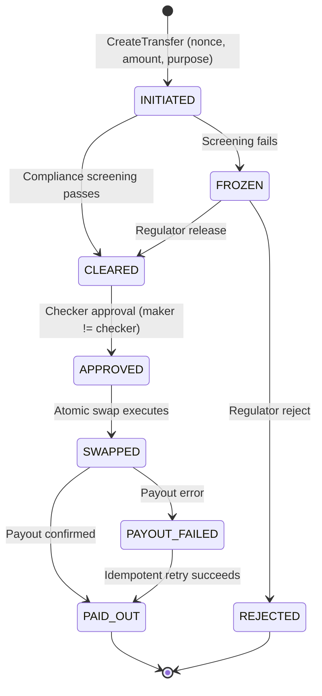
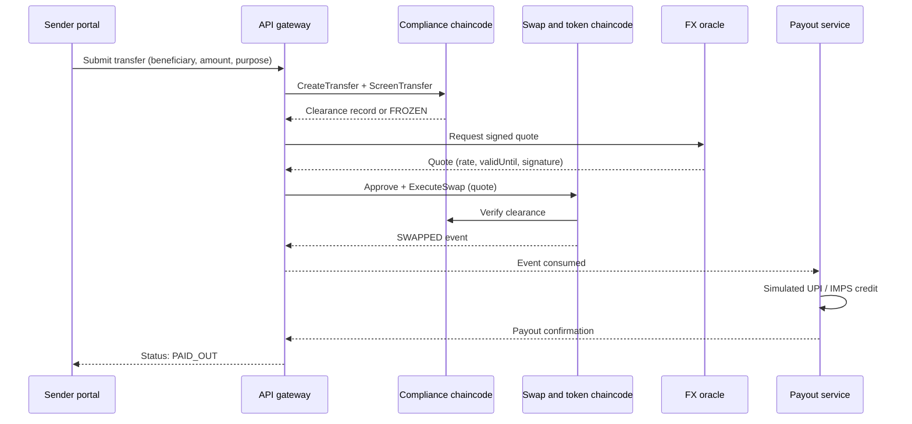

# Project Axis

**Compliance-enforced cross-border settlement on Drunix. USD to INR via tokenized bank deposits and real-time payout.**

Built for the Drunix Hackathon in collaboration with Citi, organised by the India Blockchain Forum. Challenge code: CHL-7007. Theme: Cross-Border Remittances (with Real-Time Payments elements).

---

## Project status

| Item | Status |
|---|---|
| Phase | Proposal and architecture |
| Pitch deck | Submitted for the 25 October 2026 deadline |
| Drunix test network | Planned |
| Chaincode (compliance, token ledger, atomic swap) | Planned |
| Gateway, FX oracle, payout service | Planned |
| Dashboards | Planned |
| Adversarial test suite | Planned |

Everything described below the status table is the **design we are committing to build**. The "Implementation status" column in each section is updated as components are built. Nothing marked "Planned" should be read as working software.

---

## Table of contents

1. [Overview](#1-overview)
2. [Problem](#2-problem)
3. [Solution](#3-solution)
4. [Scope and simulated components](#4-scope-and-simulated-components)
5. [Architecture](#5-architecture)
6. [Drunix integration](#6-drunix-integration)
7. [Transfer lifecycle](#7-transfer-lifecycle)
8. [Data model](#8-data-model)
9. [Compliance design](#9-compliance-design)
10. [Token and swap design](#10-token-and-swap-design)
11. [Security model](#11-security-model)
12. [Technology stack](#12-technology-stack)
13. [Repository structure](#13-repository-structure)
14. [Getting started](#14-getting-started)
15. [Demo flow](#15-demo-flow)
16. [Evaluation and metrics](#16-evaluation-and-metrics)
17. [Roadmap](#17-roadmap)
18. [Limitations and assumptions](#18-limitations-and-assumptions)
19. [Contributing back to Drunix](#19-contributing-back-to-drunix)
20. [Team](#20-team)
21. [License and IP](#21-license-and-ip)
22. [Acknowledgments](#22-acknowledgments)

---

## 1. Overview

Project Axis is an interbank liquidity corridor. A sender bank, a beneficiary bank in India and a regulator share one permissioned Drunix ledger. Before any value moves, a compliance chaincode screens the parties. Settlement between two bank-issued tokens (bUSD and bINR) is a single atomic transaction. A settlement event then triggers a payout to the recipient over a simulated real-time rail (UPI / IMPS).

The design goal is not to add a blockchain to an existing flow. It is to move three things that are normally external to settlement onto the ledger itself: the compliance decision, the settlement logic and the audit trail.

---

## 2. Problem

Cross-border flows into India typically pass through correspondent banking chains (SWIFT). This produces four structural problems for the institutions involved:

1. **Settlement delay and cost.** Multi-day clearing through intermediary banks adds layered fees and opaque FX spreads.
2. **Trapped liquidity.** Banks pre-fund Nostro and Vostro accounts to guarantee payouts, leaving capital idle.
3. **Disconnected last mile.** The inward wire is decoupled from India's real-time domestic rails, so crediting the beneficiary depends on separate downstream processing.
4. **Off-ledger compliance.** KYC, sanctions and AML screening run asynchronously across jurisdictions, causing delays, false-positive freezes and heavy audit effort.

> Note: this README deliberately avoids quoting market-size or percentage figures that we have not sourced. Sourced figures will be added to the pitch deck, with references, before presentation.

---

## 3. Solution

| Component | What it does |
|---|---|
| Compliance chaincode | Screens sender and receiver using salted identity hashes and a transfer purpose code. Flagged or unverified parties are frozen before value moves. |
| Tokenized deposit ledger | bUSD and bINR are bank-issued tokens, minted against simulated reserve attestations with role-restricted mint and burn. |
| Atomic swap engine | Executes a bUSD to bINR swap in one transaction using a signed FX rate with expiry and slippage checks. |
| Payout service | Listens for settlement events and triggers a simulated UPI / IMPS credit. |
| Treasury and observer dashboard | Shows live transfers, liquidity balances, frozen items, pending approvals and a modeled estimate of pre-funded capital avoided. |
| Sender portal | Lets a sender enter beneficiary details, see the fee and FX rate up front, and track a transfer end to end. |

---

## 4. Scope and simulated components

What is **real** in the prototype and what is **simulated** matters for evaluating it honestly.

| Area | In the prototype |
|---|---|
| Drunix network, chaincode, endorsement policies, events | Real, running on a local Drunix test network |
| Identity screening | Real logic against a simulated allow-list; no real KYC provider |
| Reserve backing of bUSD / bINR | Simulated attestation records |
| FX rate | Simulated oracle with signed quotes; no live market feed |
| Payout to recipient | Simulated UPI / IMPS service. NPCI sandbox APIs will be used only if they are made available to participants |
| Sender bank | Modeled on the role a bank such as Citi would play. No Citi system integration is claimed |
| Regulator view | Read-mostly observer organisation on the network |

Out of scope: production key management, real customer data, real sanctions lists, real money movement, regulatory certification.

---

## 5. Architecture

```
  Sender portal (Next.js)        Treasury / observer dashboard (Next.js)
           \                                /
            \                              /
         API gateway (Node.js / TypeScript, Fabric Gateway SDK) <--- Signed FX oracle
                              |
   +--------------------------v---------------------------------+
   |            Drunix multi-org permissioned network            |
   |   Sender bank     Beneficiary bank     Regulator / observer |
   |                                                             |
   |   Compliance Registry | Token Ledger | Atomic Swap Engine   |
   |                     (Go chaincode)                          |
   +--------------------------+----------------------------------+
                              | chaincode events
                              v
                 Payout service --> simulated UPI / IMPS
```

| Layer | Responsibility | Implementation status |
|---|---|---|
| Clients | Sender portal and treasury dashboard | Planned |
| API gateway | Authenticates users, submits and evaluates transactions through the Fabric Gateway SDK, serves read models to the dashboards | Planned |
| Drunix network | Holds all settlement state and enforces compliance, token and swap rules | Planned |
| FX oracle | Publishes signed, time-limited rate quotes | Planned |
| Payout service | Consumes settlement events, performs idempotent payout calls, reports status back | Planned |

---

## 6. Drunix integration

Drunix is an open-source, enterprise-grade blockchain platform from NPCI, built as an enhanced fork of Hyperledger Fabric. Repository: https://github.com/npci/drunix

The platform features relevant to this project, as listed in the upstream project: segregated responsibility for peers, SQL database support for on-chain storage, reduced network calls for private data sharing, a stateless transaction validation service, and backwards compatibility with Hyperledger Fabric v2.5.x.

### How Axis uses Drunix

Axis is designed so that **settlement state lives in chaincode, not beside it.** The compliance decision, token balances, swap execution and the audit trail are all ledger state. Nothing is settled off-ledger.

| Chaincode | Enforces | Endorsing organisations (design choice) |
|---|---|---|
| `compliance` | Allow-list screening with salted identity hashes, purpose-code validation, freeze and release decisions | Sender bank and regulator |
| `tokenledger` | Role-restricted mint and burn of bUSD and bINR, balances, reserve attestation records | Issuing bank and regulator |
| `swap` | Single-transaction swap, signed-rate and slippage checks, nonce-based replay protection, maker-checker enforcement | Sender bank and beneficiary bank |

The endorsement policies above are our design choices. They will be validated against the actual Drunix network configuration and adjusted if the platform requires.

### Drunix-specific items to verify during build

| Item | Why it matters |
|---|---|
| Cross-chaincode invocation of `compliance` from `swap` | The swap must verify a valid clearance record inside the same transaction |
| Private data collections for identity attributes | Keeps raw attributes off the shared ledger |
| On-chain SQL state storage | Affects how balances and audit records are queried |
| Chaincode event delivery to the payout service | The payout trigger depends on reliable event consumption |

This table is maintained in the repository so reviewers can see which platform assumptions have been confirmed and which have not.

---

## 7. Transfer lifecycle





---

## 8. Data model

All monetary amounts are **integers in minor units** (for example cents and paise). No floating-point arithmetic is used in chaincode. Rates are stored as integer numerators and denominators.

| Object | Key | Main fields |
|---|---|---|
| `Party` | `party~<partyHash>` | `orgId`, `status` (ALLOWED, BLOCKED), `updatedAt` |
| `Transfer` | `transfer~<transferId>` | `senderHash`, `receiverHash`, `amountUSD`, `purposeCode`, `state`, `maker`, `checker`, `createdAt` |
| `Clearance` | `clearance~<transferId>` | `decision`, `reasonCode`, `screenedAt`, `screenedBy` |
| `Balance` | `balance~<token>~<orgId>` | `amount` |
| `Reserve` | `reserve~<token>~<ref>` | `amount`, `attestedBy`, `attestedAt` (simulated) |
| `FxQuote` | `fxquote~<quoteId>` | `pair`, `rateNum`, `rateDen`, `validUntil`, `signature` |
| `Nonce` | `nonce~<senderOrg>~<nonce>` | `transferId`, `usedAt` |

`transferId` is unique and is also the idempotency key for every state-changing call on that transfer.

---

## 9. Compliance design

1. **No raw PII on the ledger.** Party identifiers are stored as `H(salt || identifier)`, where the salt is held by the originating institution. The ledger contains only the hash and a status.
2. **Allow-list screening.** `ScreenTransfer` checks both parties against the bank-controlled allow-list. A missing or blocked party produces a FROZEN result with a reason code.
3. **Purpose code.** Each transfer carries a purpose code from an illustrative set. Invalid or missing codes fail screening.
4. **Freeze semantics.** A frozen transfer cannot be approved or swapped. Only the regulator organisation can release or reject it, and every decision is recorded.
5. **Clearance is a prerequisite, not advice.** The swap chaincode reads the clearance record and refuses to execute without a valid, unexpired CLEARED decision.

---

## 10. Token and swap design

### Tokens

- `bUSD` and `bINR` are bank-issued tokens representing deposits, not a public cryptocurrency.
- Mint and burn are restricted to the issuing bank role and require endorsement by the regulator.
- Minting must reference a reserve attestation record. In the prototype these attestations are simulated.

### Atomic swap

- The swap debits bUSD and credits bINR in a **single transaction**, so either both legs occur or neither does.
- The swap consumes a signed `FxQuote`. The chaincode rejects a quote that is expired (using the transaction timestamp, not wall-clock time), has an invalid signature, or deviates beyond the allowed slippage from the rate the sender was shown.
- Liquidity is drawn from the beneficiary bank's bINR balance in the prototype. This models, in simplified form, replacing pre-funded Nostro balances with on-demand tokenized liquidity.

### Maker-checker

- Transfers above a policy threshold require a second approver.
- The chaincode enforces that the checker identity differs from the maker identity.

---

## 11. Security model

Security is a primary deliverable of this project, not an afterthought.

### Assets and trust assumptions

| Item | Assumption |
|---|---|
| Network organisations | Known, permissioned and mutually distrusting up to the configured endorsement policy |
| FX oracle | Trusted for rate accuracy only; its signature is verified and its quotes expire |
| Gateway | Not trusted to bypass chaincode rules; all rules are enforced in chaincode |
| Payout service | Trusted to execute payouts but must be idempotent and cannot alter ledger state without a valid transaction |

### Threat model

| ID | Threat | Control | Test |
|---|---|---|---|
| AX-SEC-01 | Unauthorized mint | Role-restricted mint, regulator endorsement, maker-checker | Mint without approval must fail |
| AX-SEC-02 | Replay or double-spend | Unique `transferId` and nonce stored in chaincode state | Resubmitted transaction is rejected |
| AX-SEC-03 | Stale or forged FX rate | Signed quote, expiry via transaction timestamp, slippage bound | Injected old or unsigned rate is rejected |
| AX-SEC-04 | Compliance bypass | Swap requires a valid clearance record read within the transaction | Direct swap call without clearance fails |
| AX-SEC-05 | Weak endorsement | Explicit endorsement policy per chaincode | Under-endorsed transaction is rejected |

Additional controls that are designed in but not individually scored: determinism rules for chaincode (no wall-clock time, no randomness, no unordered map iteration), integer-only arithmetic, input validation on every entry point, and identity checks on every privileged function.

### Test results

Results for AX-SEC-01 to AX-SEC-05 will be published here once the suite is run.

| ID | Result | Notes |
|---|---|---|
| AX-SEC-01 | Not run | |
| AX-SEC-02 | Not run | |
| AX-SEC-03 | Not run | |
| AX-SEC-04 | Not run | |
| AX-SEC-05 | Not run | |

---

## 12. Technology stack

| Layer | Technology |
|---|---|
| Ledger | Drunix (Hyperledger Fabric fork), Go chaincode |
| Gateway and integration | Fabric Gateway SDK, Node.js, TypeScript |
| Frontend | Next.js, React, Tailwind CSS |
| Payout and oracle services | Node.js / TypeScript |
| Containerisation | Docker, Docker Compose |
| Testing | Go testing (chaincode), Jest (gateway and services) |

---

## 13. Repository structure

Planned layout. Directories are created as components are implemented.

```
project-axis/
├── README.md
├── LICENSE
├── docs/
│   ├── architecture.md
│   ├── threat-model.md
│   └── assumptions.md
├── chaincode/
│   ├── compliance/
│   ├── tokenledger/
│   └── swap/
├── gateway/                 API gateway (Fabric Gateway SDK)
├── services/
│   ├── fx-oracle/
│   └── payout/
├── web/
│   ├── sender-portal/
│   └── treasury-dashboard/
├── network/                 Scripts wrapping the Drunix test network
├── tests/
│   ├── chaincode/
│   └── adversarial/         AX-SEC-01 .. AX-SEC-05
└── docker-compose.yml
```

---

## 14. Getting started

> This section is finalised after the Drunix test network has been brought up and verified by the team. Until then it lists prerequisites and the intended flow. Do not treat commands here as tested.

### Prerequisites

- Linux environment (the Drunix sample network is expected to be used on Linux; Windows workarounds are reported by other participants)
- Docker and Docker Compose
- Go (version matching the upstream Drunix `go.mod`)
- Node.js and npm
- Git

### Step 1: Drunix test network

Follow the sample test network instructions in the upstream repository: https://github.com/npci/drunix

The upstream code is **not** vendored or modified in this repository. The `network/` directory only contains helper scripts that call into it.

### Step 2: Deploy chaincode

Planned: a script in `network/` packages and deploys `compliance`, `tokenledger` and `swap` to the channel with their endorsement policies.

### Step 3: Start services

Planned: `docker compose up` starts the gateway, FX oracle, payout service and both web apps.

### Step 4: Run the demo and tests

Planned: a documented sequence that runs the happy path, the frozen path, and the adversarial suite.

Exact commands, expected outputs and troubleshooting notes will be added here.

---

## 15. Demo flow

Follows the recommended flow from the hackathon FAQ: Problem, User Journey, Solution, Architecture, Drunix Flow, Working Prototype, Impact.

1. **Problem.** Correspondent-banking friction and off-ledger compliance.
2. **User journey.** A sender initiates a USD to INR transfer and sees the fee and rate up front.
3. **Happy path.** Screening passes, the swap executes atomically, the payout is simulated, and the status reaches PAID_OUT.
4. **Frozen path.** A flagged party causes the transfer to freeze on the ledger; the regulator view shows the alert and reason code.
5. **Attack demo.** Each AX-SEC scenario is run against the system and shown to fail.
6. **Treasury view.** Liquidity balances, pending approvals and the modeled capital-efficiency estimate.

---

## 16. Evaluation and metrics

These are prototype targets. They are measured in a simulated environment and reported as measured, not assumed.

| Metric | Target | How it is measured |
|---|---|---|
| End-to-end settlement time | Under 10 seconds | Timestamps from transfer initiation to simulated payout confirmation, over a batch of test transfers. Compared against a modeled correspondent-banking baseline whose assumptions are stated |
| Compliance gate coverage | 100% of test transfers screened before any token movement | Ledger inspection: no swap exists without a prior clearance record |
| Adversarial tests | 5 of 5 scenarios blocked | AX-SEC suite results published in section 11 |
| Capital efficiency | Reported as a modeled estimate | Model assumptions (ticket size, pre-funding ratio, turnover) documented in `docs/assumptions.md` |

---

## 17. Roadmap

Dates follow the hackathon schedule.

| Date | Milestone | Status |
|---|---|---|
| 9 Oct 2026 | Innovation and build kickoff | Upcoming |
| 25 Oct 2026 | Pitch submission | In progress |
| 10 Nov 2026 | Top 25 announced | Upcoming |
| 10 - 22 Nov 2026 | Prototype build | Upcoming |
| 22 Nov 2026 | Final solution submission | Upcoming |
| 27 Nov 2026 | Top 5 finalists announced | Upcoming |
| 4 Dec 2026 | Grand finale (hybrid, Pune / Zoom) | Upcoming |

Build order: (1) Drunix network and threat model, (2) Go chaincodes, (3) gateway, FX oracle, payout service and dashboards, (4) adversarial testing, demo recording and documentation.

- [ ] Drunix test network running
- [ ] `compliance` chaincode
- [ ] `tokenledger` chaincode
- [ ] `swap` chaincode
- [ ] Gateway
- [ ] FX oracle
- [ ] Payout service
- [ ] Sender portal
- [ ] Treasury dashboard
- [ ] Adversarial suite and published results
- [ ] Demo recording
- [ ] Final README (setup and execution steps verified)

---

## 18. Limitations and assumptions

- The prototype runs on a local test network, not production infrastructure.
- Reserve backing, FX rates, identities and payout are simulated.
- Limits on real-world rails (for example per-transaction limits on UPI and IMPS) are not modeled unless stated; the simulated payout does not claim to match real rail constraints.
- Regulatory reporting obligations for inward remittances are represented only by a purpose code field, not a full reporting workflow.
- Cost and capital-savings figures are modeled estimates with stated assumptions, not measurements of real bank operations.
- Platform assumptions listed in section 6 are unverified until confirmed on the running Drunix network.

---

## 19. Contributing back to Drunix

The hackathon encourages code contributions to the Drunix platform. If our testing surfaces a gap or a reusable improvement, for example a chaincode security check or a documentation fix, we intend to propose it upstream following the contribution guidelines at https://github.com/npci/drunix. Contributions, if any, will be listed here with links.

---

## 20. Team

| Name | Role | GitHub |
|---|---|---|
| Vedant S. Jadhav | Team lead | ferroflux |
| (add) | (add) | (add) |
| (add) | (add) | (add) |
| (add) | (add) | (add) |

---

## 21. License and IP

The solution and code remain the intellectual property of the participants, per the hackathon FAQ. Proposed licence: Apache License 2.0, consistent with the upstream Drunix project. Add a `LICENSE` file before final submission.

This is a hackathon prototype. It is not production software, does not handle real customer data or real money, and is not financial or legal advice.

---

## 22. Acknowledgments

- NPCI, for the open-source Drunix platform: https://github.com/npci/drunix
- Citi and the India Blockchain Forum, for organising the hackathon and providing mentorship
- The Hyperledger Fabric community, on which Drunix is built
